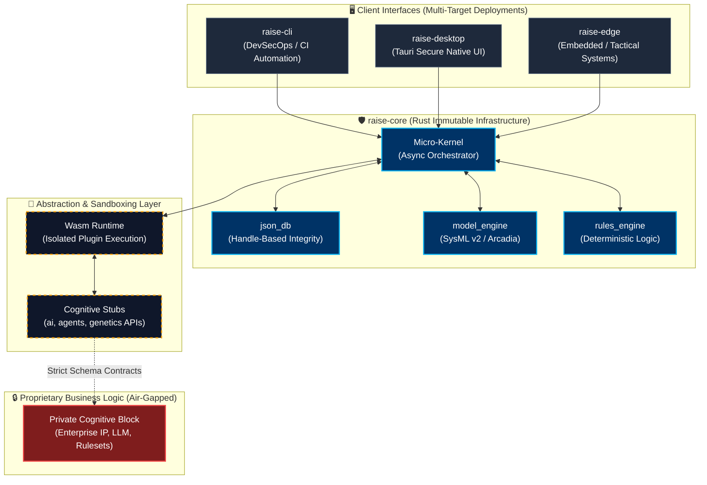

# 🚀 R.A.I.S.E. Open Core Framework

**Rationalized Advanced Intelligence System Engine.** *Sovereign Infrastructure and "Local-First" Architecture for Critical Engineering.*


---

### 📢 Project Status: v0 [Archive / Conception Phase Complete]

> [!NOTE]
> **Completion of Initial Conception Phase (v0):** This repository marks the culmination of six months of R&D focused on the RAISE core infrastructure and its foundational cognitive block.
> * **Repository Status:** This repository is now archived as the historical "Open Core" foundation and is maintained in read-only mode for reference.
> * **v1 Transition:** Active development has transitioned to a new dedicated repository for v1. All future features and roadmap updates will be managed there.
> * **Intellectual Property:** In accordance with our licensing model, only the generated framework code is open-source. SysML schemas, internal databases, and specialized cognitive blocks remain proprietary intellectual property.
 


---

> [!IMPORTANT]  
> **🌟 UPDATE v0.3.0 (Architecture Shift):** RAISE has solidified its foundation as an **Open Core Framework**. This repository contains the highly secure infrastructure chassis (Rust, Wasm, Tauri). Cognitive intelligence modules, multi-agent solvers, and proprietary business logic are designed to be plugged into this public core via strict, isolated interfaces.

## 💡 Vision: Sovereign Critical Engineering

In critical engineering (Aerospace, Defense, Energy), sovereignty, data integrity, and strict decoupling are non-negotiable. RAISE provides a modern infrastructure aligning with Industry 4.0 standards (MBSE 2.0, SysML v2, RAMI 4.0) through a **100% Air-Gap** capable architecture.

The public framework acts as an impenetrable shield and orchestrator, ready to host specialized cognitive engines without compromising the host system.

---

## 🗺️ Architecture Overview

The following diagram illustrates the strict decoupling between the public infrastructure (Open Core) and the isolated abstraction layers designed to host proprietary cognitive engines.



---

## 🏗️ Architectural Pillars (Zero-Debt Implementation)

### 1. Absolute Data Integrity (Handle-Based DB)

RAISE abandons fragile internal identifiers.

* **Deterministic Relationships:** The internal `json_db` engine strictly utilizes explicit **Handles** instead of volatile `_id` or auto-generated UUIDs.
* **Strict Data Agents:** Data agents operate exclusively with explicit schema arguments to guarantee end-to-end data validation.

### 2. The Fortress Dogma (Rust Core)

The engine is built on Rust to ensure absolute memory safety and high-performance topological simulation.

* **Production Purity:** RAISE enforces a strict zero-tolerance policy for testing artifacts. **Absolutely no test conditions are included in production code.** The runtime is pure, deterministic, and industrial-grade.
* **Asynchronous Micro-Kernel:** Efficient orchestrator built to handle non-blocking messages across highly decoupled modules.

### 3. Wasm Sandboxing & Extensibility

How do we execute proprietary, critical AI models safely?

* **Isolated Plugins:** Extensibility is managed through WebAssembly (Wasm) sandboxes. This protects the core runtime from plugin panics or memory leaks.
* **Cognitive Stubs:** The `src/` directory includes abstract interfaces (`ai`, `agents`, `genetics`, `blockchain`). These are pure structural contracts (APIs/Traits) waiting to be implemented by private, domain-specific intellectual property.

### 4. Context-Aware Toolchain (DevSecOps)

* **`raise-desktop`:** A secure, lightweight, native user interface powered by Tauri.
* **`raise-cli`:** Designed for CI/CD automation. **Smart Fallback:** By default, if the `--domain` or `--db` arguments are not explicitly specified during a command, the CLI automatically falls back to the `current_domain` and `current_db` of the active session.

---

## 📂 Repository Topology

```text
raise/
├── raise-cli/        # DevSecOps command-line automation
├── raise-desktop/    # Tauri-based secure local interface
├── raise-edge/       # Lightweight deployments for constrained environments
└── raise-core/       # The Core Infrastructure
    └── src/
        ├── kernel/           # Core orchestrator
        ├── json_db/          # Handle-based local data store
        ├── rules_engine/     # Deterministic logical validation
        ├── model_engine/     # MBSE 2.0 / SysML v2 data structures
        ├── plugins/          # WebAssembly isolation layer
        ├── code_generator/   # Ast-to-Source code weaving
        └── [ai/ agents/]     # API Stubs for future cognitive extensions

```

---

## 🛡️ Sovereignty & Trust

* **Local-First / Offline-First:** Zero dependency on external SaaS or Cloud APIs. The entire infrastructure is designed to operate in highly classified, completely disconnected zones.
* **Zero-Trust Ready:** Verification at every step, enforced by the schema-driven data agents and immutable state management.

---

## 🚀 Getting Started

### 1. Clone the Sovereign Core

```bash
git clone https://github.com/Condorcet-Continuum/raise.git
cd raise

```

### 2. Build the DevSecOps CLI

```bash
cd crates/raise-cli
cargo build --release

```

### 3. Launch the Secure Desktop Environment (Tauri)

```bash
cd crates/raise-desktop
npm install
cargo tauri dev

```

---